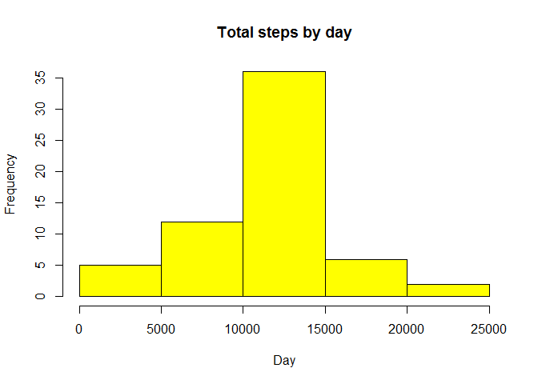

# Reproducible Research: Peer Assessment 1


## Loading and preprocessing the data

```r
aa = read.csv("activity.csv")
```


## What is mean total number of steps taken per day?
By ignoring the missing values in the dataset - 

```r
library(ggplot2)
table1 = matrix(data=0, ncol  =2, nrow = length(unique(aa$date)))
colnames(table1) = c("Day", "Total steps")
all_dates = as.character(unique(aa$date))
for(i in 1:length(all_dates)){
     mdate = aa[which(aa$date==all_dates[i]),]
     table1[i, ] = c(all_dates[i], as.numeric(sum(mdate$steps)))
}
histTable = data.frame(Date = 1:length(unique(aa$date)), Total_Steps = as.numeric(table1[,2]), stringsAsFactors=FALSE)
histTable = na.omit(histTable)
qplot(na.omit(histTable$Total_Steps), geom="histogram", bins=10,xlab="Total number of steps", ylab = "Frequency", main="Total steps daily")
```

<!-- -->


And the mean and median of total steps are the following - 

```r
mean(histTable$Total_Steps)
```

```
## [1] 10766.19
```

```r
median(histTable$Total_Steps)
```

```
## [1] 10765
```


## What is the average daily activity pattern?

```r
time_series = tapply(aa$steps, aa$interval, mean, na.rm=TRUE)
plot(row.names(time_series), time_series, type="l", xlab = 
          "5-min interval", ylab = "Average across all Days",
     main = "Average number of steps taken in 5 minutes interval", col = "green")
```

<!-- -->

The following 5-minute interval, on average across all days in the dataset contains the maximum number of steps -

```r
max_interval = which.max(time_series)
names(max_interval)
```

```
## [1] "835"
```


## Imputing missing values
The total number of missing values in the dataset are -

```r
total_NA = sum(is.na(aa$steps))
total_NA
```

```
## [1] 2304
```

Filling up all the missing values in the dataset with the following method - 
Mean according to the intervals

```r
averagesteps = aggregate(steps ~ interval, data = aa, FUN = mean) #take the mean of each interval for usage of NA slots
appendNA = numeric()
for(i in 1:nrow(aa)){
     obs = aa[i,]
     if(is.na(obs$steps)){
          steps = subset(averagesteps, interval == obs$interval)$steps
     } else {
          steps = obs$steps
     }
     appendNA = c(appendNA, steps)
}
```

Now to create a new dataset with "no" NAs

```r
new_dataset = aa
new_dataset$steps = appendNA
```

Creating histogram of "no NAs" new dataset

```r
stepstotal2 = aggregate(steps ~ date, data = new_dataset, sum, na.rm=TRUE)

hist(stepstotal2$steps, main = "Total steps by day", xlab = "Day", col = "yellow")
```

<!-- -->


The mean and median of total number of steps taken per day are -

```r
mean(stepstotal2$steps)
```

```
## [1] 10766.19
```

```r
median(stepstotal2$steps)
```

```
## [1] 10766.19
```


## Are there differences in activity patterns between weekdays and weekends?
Create new factors: "weekday" and "weekend"

```r
library(lubridate)
```

```
## Warning: package 'lubridate' was built under R version 3.3.2
```

```
## 
## Attaching package: 'lubridate'
```

```
## The following object is masked from 'package:base':
## 
##     date
```

```r
day = weekdays(as.Date(aa$date))
daytype = vector()
for(i in 1:nrow(aa)){
     if (day[i] == "Saturday"){
          daytype[i] = "Weekend"
     } else if (day[i]== "Sunday"){
          daytype[i] = "Weekend"
     } else{
          daytype[i] = 'Weekday'
     }
}
aa$daytype = daytype
aa$daytype = factor(aa$daytype)
```

#Line plot to compare weekday to weekend


```r
stepsbyday = aggregate(steps ~ interval + daytype, data = aa, mean)
names(stepsbyday) = c("interval", "daylevel", "steps")
library(lattice)
xyplot(steps ~ interval |daylevel, stepsbyday, type = "l", layout = c(1,2),
       xlab = "Interval", ylab = "Number of steps")
```

<!-- -->
